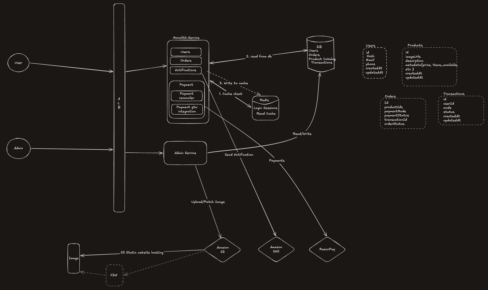

   
## Overview
A system design exercise for a small e-commerce platform. 
This covers requirements gathering, capacity estimation, 
component selection, and architecture decisions for a 
budget-conscious, low-scale production system.

## Problem statement
Design a backend system for a small e-commerce website for a local shopkeeper. The shopkeeper wants to sell their products online, manage inventory, and accept payments. Customers should be able to browse products, place orders, and track their deliveries.

### what is the scale we are expecting here & how many products?
#### Features (in scope):

- Product browsing, search, and filtering
- Shopping cart
- Order placement and order history
- Basic payment integration (assume a third-party gateway like Razorpay)
- Inventory management via an admin panel
- Order status tracking (e.g. Pending → Shipped → Delivered)
- Email/SMS notifications on order updates

#### Out of scope (for now):
- Recommendations / personalization
- Reviews and ratings
- Multi-vendor support
- Mobile app (web only)

#### Constraints:
- Budget is limited so keep infra simple and cost-effective
- Consistency matters - inventory should never oversell (if 2 users order the last item simultaneously, only one should succeed)
- Payments must be reliable — no silent failures
- Downtime should be minimal but this is not a high-availability system like a bank — a few minutes of downtime is acceptable

#### Functional Requirements:
- Customers can browse, search, and filter products
- Customers can add items to a shopping cart
- Customers can place orders and make payments via a third-party gateway (Razorpay)
- Customers can view their order history and track order status
- Shopkeeper can manage products and inventory via an admin panel
- Order status transitions — Pending → Shipped → Delivered
- Email/SMS notifications sent on order status updates

#### Non-Functional Requirements:
- Consistency = no overselling; inventory updates must be atomic
- Reliability = payment failures must be handled gracefully, no silent failures
- Scalability = handle 2–3x traffic spikes during peak periods
- Availability = reasonable uptime, minor downtime acceptable
- Cost efficiency = simple, lean infrastructure given limited budget
- Low latency = product browsing and search should feel fast

#### Calculations & decisions:
- One product catalog = 1 KB X 500 products = 500KB Data
- product images == 5 MB X 500 = 2500MB
- User metadata = 1KB X 1000 = 1 MB (In the worst case lets consider 2 MB)
- 100 Orders daily = 100 money transactions via RazorPay
- As Data of product and user is very low and we need queryable db, selecting relational db - Mysql Only one instance.
- small Redis instance to cache DB read queries & login sessions
- As we need to keep infra lean and simple and we don't have much scale = considering one monolith service with multiple modules
- s3 regional bucket for static website hosting where we can keep photos of product and urls in DB

| Decision | Choice | Reasoning |
|---|---|---|
| Service architecture | Monolith | Low scale, lean budget, simpler ops |
| Primary DB | MySQL | Relational data, ACID needed, small dataset |
| Cache | Redis | Session storage + product read cache |
| Image storage | S3 | Offloads binary from DB, CDN-friendly |
| Notifications | Amazon SNS | Managed Email + SMS, no infra to maintain |
| Payment | Razorpay | Third-party, handles PCI compliance |

##### Critical Flows

###### Inventory Consistency
Order placement uses `SELECT FOR UPDATE` inside a MySQL 
transaction to atomically check and decrement stock, 
preventing overselling under concurrent requests.

###### Payment Reconciliation
A reconciler module polls the Transactions table for entries 
stuck in `pending` beyond X minutes. It calls the Razorpay 
API to verify actual payment status and updates the DB 
accordingly  handling crash/webhook-miss scenarios.

#### Trade-offs & Conscious Decisions

- **No SQS between order service and SNS**  notifications may 
  be missed if SNS times out, but order placement is unaffected. 
  Acceptable at this scale; SQS would be added if reliability 
  becomes a concern.
- **Single MySQL instance**  no read replica or failover. Minor 
  downtime is acceptable per requirements. A replica would be 
  the first scaling step.
- **No CDN (CloudFront)**  S3 serves images directly. Would add 
  CloudFront as a next step for latency improvement.
- **Admin concurrency** no optimistic locking on bulk admin 
  updates. Acceptable given single shopkeeper usage.

## Architecture Diagram

